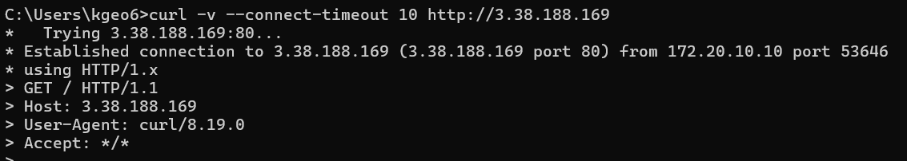
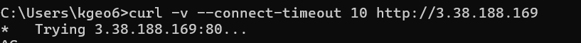

## Kubernetes HA 클러스터 인프라 구성

EC2(control-plane) + EC2(worker-node) 조합으로 Kubernetes 클러스터를 프로비저닝한다.

### 왜 만들었는가

Kubernetes 클러스터를 올리려면 그 아래에 네트워크(VPC, 서브넷, 라우팅, 보안 그룹)와 컴퓨팅(control-plane / worker-node 인스턴스)이 먼저 갖춰져야 한다. 이 사전 인프라를 콘솔에서 수동으로 클릭해 만들면 매번 구성이 미묘하게 달라지고, 무엇을 어떤 이유로 그렇게 설정했는지 기록이 남지 않는다.

이 프로젝트는 클러스터 아래의 인프라 전체를 Terraform(IaC) 코드로 정의해 **재현 가능하고 버전 관리되는 형태**로 만드는 것을 목표로 한다. 같은 코드로 언제든 동일한 환경을 다시 세우고, 변경 이력을 git으로 추적하며, 구성의 근거를 코드와 문서에 함께 남긴다.

### 어떤 문제를 어떻게 풀었는가

인프라를 한 번에 완성하지 않고, 실제로 부딪힌 문제를 버전 단위로 풀어 나가며 발전시켰다.

- **노드 간 통신이 인터넷을 경유하는 문제 (v1 → v2)** — v1은 LightSail(control-plane)과 EC2(worker-node)를 조합했으나, 둘은 서로 다른 네트워크라 public IP로 통신해야 했다. Kubernetes 핵심 컴포넌트는 private IP 기준으로 통신하므로 이는 보안 노출과 데이터 전송 비용으로 이어진다. LightSail은 커스텀 VPC와 피어링할 수 없어, **전 노드를 EC2로 통일하고 커스텀 VPC 하나에 배치**해 private IP 직접 통신으로 전환했다.

- **control-plane이 인터넷에 직접 노출되는 문제 (v2 → v3 예정)** — v2의 control-plane은 SSH 관리를 위해 Public IP를 가진다. 보안 그룹으로 막아도 외부에서 도달 가능한 경로 자체가 존재한다. v3에서는 **외부 진입점을 Reverse Proxy EC2 하나로 좁히고**, control-plane과 worker-node를 모두 Private Subnet에 격리한 뒤 control-plane 접근은 SSM Session Manager + VPC Endpoint로 처리한다.

- **CNI 교체마다 보안 그룹을 고쳐야 하는 문제** — CNI(Flannel/Calico/Cilium)와 모드에 따라 노드 간 필요 포트가 달라진다. 특정 포트만 열면 CNI를 바꿀 때마다 SG를 수정해야 한다. 노드 간 규칙을 CIDR이 아닌 **SG 참조(all-to-all)로 전체 허용**해, 어떤 CNI든 동작하면서도 출처는 클러스터 노드로만 한정했다.

각 결정의 자세한 근거는 아래 버전별 섹션에 정리되어 있고, 구축 중 겪은 운영 이슈는 각 버전의 **트러블슈팅** 항목에 따로 기록한다.

### 버전 인덱스

- [v1: LightSail + EC2 조합 — 클러스터 구축을 위한 인스턴스 생성](#v1-lightsail--ec2-조합)
- [v2: EC2 전용 구성 + VPC](#v2-ec2-전용-구성--vpc)
  - [트러블슈팅: t3.small에서 빌드 중 OOM 발생](#t3small에서-빌드-중-oom-발생)
- [v3: Reverse Proxy 기반 보안 강화 (진행 중)](#v3-reverse-proxy-기반-보안-강화-진행-중)
  - [진행 방식 (단계별)](#진행-방식-단계별)
  - [1단계: SSM IAM과 VPC Endpoint 구성 (완료)](#1단계-ssm-iam과-vpc-endpoint-구성-완료)
  - [2단계: control-plane Private 이동과 NAT Instance (완료)](#2단계-control-plane-private-이동과-nat-instance-완료)
    - [트러블슈팅: Private 이동 후 인터넷 outbound 단절](#트러블슈팅-private-이동-후-인터넷-outbound-단절)
  - [3단계: Reverse Proxy (완료)](#3단계-reverse-proxy-완료)
  - [4단계: NACL 도입 (완료)](#4단계-nacl-도입-완료)
  - [5단계: control-plane HA와 내부 NLB (완료)](#5단계-control-plane-ha와-내부-nlb-완료)
    - [트러블슈팅: 내부 NLB 헤어핀 문제](#트러블슈팅-내부-nlb-헤어핀-문제)

---

## 버전 이력

| 버전 | 구성 | 네트워크 | 목적 |
|---|---|---|---|
| v1 | LightSail(control-plane) + EC2(worker-node) | Public IP 통신 | 기본 클러스터 프로비저닝 구성 |
| v2 | EC2(control-plane) + EC2(worker-node) | VPC 기반 private 통신 | VPC 구성 및 control-plane EC2 전환 |
| v3 | EC2(reverse-proxy, public) + control-plane 3대 + worker-node 2대(private) + 내부 NLB | Public/Private Subnet 분리, SSM 내부망 접근, apiserver 내부 NLB | Reverse Proxy 도입, control-plane 폐쇄망 + HA(쿼럼·단일 엔드포인트) 구성 |

---

## v1: LightSail + EC2 조합

LightSail과 EC2를 조합해 control-plane과 worker-node를 구성했다. LightSail은 EC2와 별개의 네트워크에 존재하기 때문에 노드 간 통신은 public IP를 통해 이루어진다.

### 디렉토리 구조

```
templates/
├── provider.tf            # AWS provider 설정
├── variables.tf           # 루트 변수 선언 (EC2 + Lightsail)
├── outputs.tf             # 최종 출력값
├── main.tf                # 모듈 호출 진입점
├── control-plane.tfvars   # control-plane 변수 값 파일
├── worker-node.tfvars     # worker-node 변수 값 파일
└── modules/
    ├── ec2/               # worker-node 모듈
    │   ├── main.tf
    │   ├── variables.tf
    │   └── outputs.tf
    └── lightsail/         # control-plane 모듈
        ├── main.tf
        ├── variables.tf
        └── outputs.tf
```

### 파일별 설명

#### provider.tf

사용할 클라우드 provider와 버전, 리전을 선언한다.

- `required_providers` — provider 출처(`hashicorp/aws`)와 버전 제약(`~> 6.0`)
- `region` — 리소스를 생성할 리전 (`ap-northeast-2`)

#### variables.tf

하드코딩된 값을 변수로 분리해 재사용성과 유연성을 높인다. `tfvars`로 값을 주입받는 창구 역할을 한다.

모듈 변수에 default가 있으면 루트에도 동일한 default를 선언하고, default가 없으면 tfvars에 명시한다.

**EC2 (worker-node) 변수**

| 변수 | 기본값 | 설명 |
|---|---|---|
| `worker_nodes` | 없음 | worker-node 목록 (map) |
| `worker_key_pair_name` | 없음 | 모든 worker-node가 공유할 키 페어 이름 |
| `public_key_path` | 없음 | 로컬 SSH 공개키(.pub) 경로 |
| `ssh_allowed_cidr` | 없음 | SSH 허용 CIDR 목록 |

**EC2 (control-plane) 변수**

| 변수 | 기본값 | 설명 |
|---|---|---|
| `control_plane_instance_name` | 없음 | 인스턴스 이름 |
| `control_plane_instance_type` | `t3.medium` | EC2 인스턴스 타입 |
| `control_plane_root_volume_size` | `30` | 루트 볼륨 크기 (GB) |
| `control_plane_root_volume_type` | `gp3` | 루트 볼륨 타입 |
| `control_plane_ssh_allowed_cidr` | 없음 | SSH 허용 CIDR 목록 |

#### main.tf

모듈을 호출하는 진입점. 어떤 모듈을 어떤 값으로 실행할지 선언한다.

- `module "control_plane"` — `modules/ec2` 모듈 호출 (control-plane 단일 인스턴스)
- `aws_key_pair "worker_node"` — control-plane과 worker-node가 공유할 키 페어를 루트에서 한 번만 생성
- `module "worker_node"` — `modules/ec2` 모듈을 `for_each`로 반복 호출 (`worker_nodes` map 크기만큼)

`aws_key_pair`를 모듈 밖에 선언하는 이유는 `for_each`로 인해 모듈이 여러 번 실행되더라도 키 페어는 한 번만 생성하기 위해서다.

#### outputs.tf

모듈이 반환한 값을 최종 출력한다.

- `worker_node_instance_ids` — worker-node별 EC2 인스턴스 ID
- `worker_node_public_ips` — worker-node별 Public IP
- `worker_node_private_ips` — worker-node별 Private IP
- `control_plane_public_ip` — control-plane Public IP
- `control_plane_private_ip` — control-plane Private IP

#### control-plane.tfvars

control-plane(EC2) 관련 변수 값을 정의한다.

- 인스턴스 이름, 타입, 볼륨 사양
- SSH 허용 CIDR, 추가 인바운드 규칙 (HTTP/HTTPS)

#### worker-node.tfvars

worker-node(EC2) 관련 변수 값을 정의한다.

- SSH 공개키 경로, 키 페어 이름, SSH 허용 CIDR
- 추가 인바운드 규칙 (HTTP, HTTPS, 8080)
- worker-node 목록 (인스턴스 타입, 이름, 볼륨 사양)

#### modules/ec2/

**control-plane 및 worker-node** EC2 인스턴스를 생성하는 공용 모듈.

- `main.tf` — AMI data source 4종(Ubuntu 22/24, Rocky 9, Amazon Linux 2023), `aws_security_group`, `aws_instance` 리소스 정의
- `variables.tf` — 모듈 내부 변수 선언 (루트에서 넘긴 값을 받는 창구)
- `outputs.tf` — `instance_id`, `public_ip`, `private_ip`, `ami_id` 반환

`aws_security_group`은 SSH 고정 인바운드(`ssh_allowed_cidr`)만 허용한다. 노드 간 SG 참조 규칙은 루트에서 `aws_security_group_rule`로 관리한다.

#### modules/lightsail/

v1에서 **control-plane**으로 사용한 Lightsail 모듈. v2부터는 사용하지 않는다.

- `main.tf` — `aws_lightsail_key_pair`, `aws_lightsail_instance`, `aws_lightsail_instance_public_ports` 리소스 정의
- `variables.tf` — 모듈 내부 변수 선언
- `outputs.tf` — `instance_id`, `public_ip`, `private_ip` 반환

### 네트워크 구조

Lightsail과 EC2는 기본적으로 서로 다른 네트워크에 위치한다. 현재는 public IP를 통해 통신하며, 추후 VPC 피어링 또는 EC2 통합을 통해 private IP 통신으로 전환할 예정이다.

```
내 PC ──(public IP)──▶ control-plane (Lightsail)
                              │
                        (public IP)
                              │
                 ┌────────────┴────────────┐
             worker-1 (EC2)          worker-2 (EC2)
```

### 실행 흐름

`terraform apply -var-file=control-plane.tfvars -var-file=worker-node.tfvars` 실행 시 아래 순서로 파일을 읽는다.

```
1. provider.tf
   └─ AWS provider 설정, 리전 확인

2. variables.tf
   └─ 변수 목록 확인 (어떤 변수가 있는지 등록)

3. control-plane.tfvars + worker-node.tfvars
   └─ variables.tf의 변수에 실제 값 주입

4. main.tf
   └─ module "control_plane" 발견 → modules/ec2/ 로 이동
   └─ module "worker_node"   발견 → modules/ec2/ 로 이동 (for_each)

5. modules/ec2/variables.tf (control_plane)
   └─ main.tf에서 넘긴 값 받음

6. modules/ec2/main.tf (control_plane)
   └─ aws_instance 등 리소스 정의 읽음

7. modules/ec2/outputs.tf (control_plane)
   └─ 모듈이 반환할 값 정의

8. modules/ec2/variables.tf (worker_node)
   └─ main.tf에서 넘긴 값 받음

9. modules/ec2/main.tf (worker_node)
   └─ aws_instance 등 리소스 정의 읽음

10. modules/ec2/outputs.tf (worker_node)
    └─ 모듈이 반환할 값 정의

11. outputs.tf
    └─ module.control_plane.xxx, module.worker_node.xxx 참조해 최종 출력
```

### Terraform CLI

#### 포맷 정렬
```shell
terraform fmt
```

#### 문법 확인
```shell
terraform validate
```

#### 실행 계획 확인
```shell
terraform plan \
  -var-file="control-plane.tfvars" \
  -var-file="worker-node.tfvars"
```

#### 인프라 생성
```shell
terraform apply \
  -var-file="control-plane.tfvars" \
  -var-file="worker-node.tfvars"
```

#### 인프라 삭제
```shell
terraform destroy \
  -var-file="control-plane.tfvars" \
  -var-file="worker-node.tfvars"
```

#### 모듈 초기화 (모듈 추가/변경 후 필수)
```shell
terraform init
```

---

## v2: EC2 전용 구성 + VPC

Kubernetes의 kubelet, kube-proxy, API server 등 핵심 컴포넌트는 private IP를 기준으로 서로를 식별하고 통신한다. v1에서 public IP로 통신하면 트래픽이 인터넷을 경유하게 되어 보안 노출이 생기고, 불필요한 데이터 전송 비용도 발생한다.

LightSail은 AWS가 관리하는 별도의 내부 네트워크를 사용한다. EC2의 VPC와 연결하려면 VPC 피어링이 필요한데, LightSail이 피어링할 수 있는 대상은 default VPC로 제한된다. 따라서 커스텀 VPC를 사용하는 EC2 노드와는 private IP로 직접 통신할 수 없다.

이를 해결하기 위해 control-plane을 LightSail에서 EC2로 전환한다. 모든 노드를 EC2로 통일하면 동일한 커스텀 VPC 안에 배치할 수 있어 private IP 통신이 가능해진다.

default VPC를 사용하지 않고 커스텀 VPC를 직접 생성하는 이유는 다음과 같다.

- default VPC는 AWS 계정 생성 시 자동으로 만들어지며 CIDR(`172.31.0.0/16`)과 서브넷 구성이 고정되어 있어 변경하기 어렵다.
- 커스텀 VPC를 사용하면 IP 대역, 서브넷 분리, 라우팅 테이블을 처음부터 직접 설계할 수 있다.
- Kubernetes 클러스터에 맞는 네트워크 구조(control-plane / worker-node 서브넷 분리 등)를 갖추려면 커스텀 VPC가 필요하다.

### 서브넷 구성

control-plane은 Public Subnet에, worker-node는 Private Subnet에 배치한다.

worker-node는 실제 애플리케이션 파드를 실행하는 노드로, 외부에서 직접 접근할 이유가 없다. Private Subnet에 배치하면 Public IP 없이 VPC 내부에서만 통신하므로 불필요한 외부 노출을 줄일 수 있다.

control-plane은 SSH로 직접 접근해 클러스터를 관리해야 하기 때문에 Public IP가 필요하다. Public Subnet에 배치하고 SSH(22번 포트)를 내 IP에서만 허용하는 방식으로 외부 접근을 최소화한다. v3에서는 control-plane도 Private Subnet으로 이동하고 SSM Session Manager로 접근 방식을 전환할 예정이다.

Private Subnet에 배치된 worker-node가 외부 인터넷에 접근하려면 원래 NAT Gateway가 필요하다. 그러나 NAT Gateway는 시간당 요금과 데이터 처리 요금이 발생하기 때문에 프로젝트 비용을 고려해 v2에서는 생략했다.

### 인스턴스 사양 선택

실제 파드는 worker-node에서 실행되므로, worker-node의 CPU·메모리가 클러스터 성능을 결정한다. control-plane은 Kubernetes 컴포넌트만 돌리고 직접 워크로드를 받지 않기 때문에 worker-node보다 낮은 사양으로도 충분하다.

초기에는 비용 문제로 전 노드를 `t3.small`로 통일했으나, 빌드 과정에서 메모리 부족(OOM)을 겪고 `c7i-flex.large`(RAM 8GB)로 상향했다(아래 [트러블슈팅](#트러블슈팅) 참고). `c7i-flex.large`는 Free Plan에서 사용할 수 있는 인스턴스 중 메모리 용량이 가장 커서 선택했다. 스토리지는 가격이 저렴해 worker-node는 30GiB, control-plane은 20GiB로 차등 적용했다.

| 노드 | 타입 | 스토리지 |
|---|---|---|
| control-plane | c7i-flex.large | 20GiB gp3 |
| worker-node × 2 | c7i-flex.large | 30GiB gp3 |

### 트러블슈팅

#### t3.small에서 빌드 중 OOM 발생

비용 때문에 전 노드를 `t3.small`(RAM 2GB)로 통일했더니, 클러스터 구축 도중 메모리가 부족해 작업이 33분 이상 멈추는 OOM이 발생했다.

원인은 Ansible `fetch` 모듈이 내부적으로 slurp을 사용해 `/tmp/k8s-worker-debs.tar.gz` 전체를 메모리에 올린 뒤 base64 인코딩하여 SSH로 전송하는 방식이었다. 아카이브 크기 + base64 오버헤드 + 실행 중인 프로세스가 가용 메모리를 초과했다.

전송 방식을 scp로 전환해 이 단계는 넘겼지만, 이후 kubeadm init, CNI 파드 스케줄링, 컨테이너 이미지 pull도 메모리를 경쟁하기 때문에 t3.small은 여전히 빠듯했다. 충분한 여유를 확보하기 위해 전 노드를 Free Plan에서 메모리 용량이 가장 큰 `c7i-flex.large`(RAM 8GB)로 상향했다.

### Security Group 구성

노드 간(Control Plane ↔ Worker, Worker ↔ Worker) 통신은 SG를 서로 참조해 전체 허용하고, SSH 같은 외부 진입 경로만 최소로 제한한다.

Kubernetes는 사용하는 CNI(Flannel/Calico/Cilium)와 동작 모드(VXLAN, IPIP, Geneve 등)에 따라 노드 간 필요 포트가 크게 달라진다. 특정 CNI 포트만 열면 CNI를 교체할 때마다 SG를 수정해야 하므로, 노드 간은 전체 허용으로 두어 어떤 CNI든 동작하게 한다. Worker Node는 Private Subnet에 있어 외부 진입 경로가 없으므로 이 전체 허용이 외부 노출로 이어지지 않는다.

SG 규칙은 CIDR이 아니라 `source_security_group_id`(SG 참조)로 정의한다. VPC CIDR이나 Subnet CIDR이 아니라 해당 SG가 붙은 클러스터 노드만 출처로 한정되므로, VPC에 다른 리소스를 추가해도 클러스터 노드와 통신하지 않는다.

**Control Plane SG (Public Subnet)**

| 방향 | 포트 | 출처 | 설명 |
|---|---|---|---|
| Inbound | 22 (SSH) | 내 IP | 외부 접근은 SSH만 허용 |
| Inbound | 전체 | Worker Node SG | Worker Node에서 오는 클러스터 트래픽 |
| Outbound | 전체 | `0.0.0.0/0` | 패키지 설치·이미지 pull 등 인터넷 접근 필요 |

**Worker Node SG (Private Subnet)**

| 방향 | 포트 | 출처 | 설명 |
|---|---|---|---|
| Inbound | 전체 | Control Plane SG | Control Plane에서 오는 클러스터 트래픽 |
| Inbound | 전체 | Worker Node SG | Worker 노드 간 통신 (CNI 오버레이, Pod 간 통신) |
| Outbound | 전체 | `0.0.0.0/0` | 패키지 설치·이미지 pull 등 인터넷 접근 필요 |

Outbound를 `0.0.0.0/0`으로 열어둔 이유는 이 프로젝트에서 kubeadm, kubectl, 컨테이너 이미지 등을 노드 안에서 직접 설치·pull해야 하기 때문이다. Outbound를 Worker Node SG로만 제한하면 인터넷 접근이 막혀 패키지를 사전에 준비해야 하므로, 편의를 위해 전체 허용을 유지한다.

Worker Node는 Private Subnet에 배치되어 Public IP가 없으므로, Outbound를 열어도 외부에서 Worker Node로 직접 들어오는 경로는 존재하지 않는다.

### Hostname 설정

`user_data`로 인스턴스 생성 시 hostname을 자동으로 설정한다.

| 노드 | hostname |
|---|---|
| control-plane | master-1 |
| worker-node-1 | worker-1 |
| worker-node-2 | worker-2 |

### SSH 접근 방법

worker-node는 Private Subnet에 배치되어 Public IP가 없다. 외부에서 직접 접속할 수 없으며, control-plane을 경유(bastion)해야 한다. SSH Agent Forwarding을 사용하면 키 파일을 control-plane에 복사하지 않고도 worker-node에 접속할 수 있다.

**1. 로컬에서 ssh-agent 실행 및 키 등록**

```bash
eval $(ssh-agent -s)
ssh-add ~/.ssh/terraform-key
```

**2. control-plane에 Agent Forwarding으로 접속**

```bash
ssh -A ubuntu@<control-plane-public-ip>
```

`-A` 옵션이 Agent Forwarding을 활성화한다. 로컬의 키가 control-plane을 통해 worker-node 인증에 사용되므로 키 파일을 서버에 올릴 필요가 없다.

**3. control-plane에서 worker-node 접속**

```bash
ssh ubuntu@<worker-node-private-ip>
```

---

## v3: Reverse Proxy 기반 보안 강화 (진행 중)

v2의 control-plane은 Public IP를 가지고 있어 보안 그룹으로 접근을 제한하더라도 인터넷에 노출된 상태다. 보안 그룹이 방어막 역할을 하지만, 서버 자체가 공인 IP를 가진다는 것은 외부에서 직접 도달 가능한 경로가 존재한다는 의미다. 외부에서 직접 접근 가능한 서버를 Reverse Proxy 하나로 최소화하고, 나머지 노드는 모두 Private Subnet에 격리해 이 문제를 해결한다.

### 진행 방식 (단계별)

v3는 한 번에 적용하지 않고, 의존 관계 순서대로 단계를 나눠 진행한다. 각 단계마다 `apply`로 동작을 검증하고 다음으로 넘어간다.

| 단계 | 내용 | 상태 |
|---|---|---|
| 1단계 | SSM IAM(Role/Instance Profile) + VPC Interface Endpoint 구성 | 완료 |
| 2단계 | control-plane을 Private Subnet으로 이동, Public IP·SSH inbound 제거 (+ NAT Instance) | 완료 |
| 3단계 | Reverse Proxy(Nginx) EC2 추가 및 Worker로의 라우팅 구성 | 완료 |
| 4단계 | NACL 도입 (서브넷 레벨 이중 방어선) | 완료 |
| 5단계 | control-plane 3대 HA 확장 + apiserver(6443) 앞 내부 NLB 단일 엔드포인트 | 완료 |

1단계를 먼저 하는 이유는, control-plane을 Private로 옮기기(2단계) 전에 SSM 접근 경로(IAM + Endpoint)가 먼저 갖춰져 있어야 하기 때문이다. 순서가 바뀌면 control-plane이 Private로 가는 순간 접근 수단이 사라진다. NACL(4단계)은 stateless라 잘못 적용하면 정상 트래픽까지 막으므로 맨 마지막에 둔다.

### 목표

- 외부에서 직접 접근 가능한 서버는 Reverse Proxy 역할의 EC2 하나만 둔다.
- control-plane과 worker-node는 모두 Private Subnet에 배치하고 Public IP를 할당하지 않는다.
- 외부 트래픽은 반드시 Reverse Proxy를 거쳐서만 Private EC2로 전달된다.
- control-plane 접근(kubectl)은 SSM Session Manager + VPC Endpoint로 인터넷 경로 없이 처리한다.
- Network ACL(NACL)을 도입해 Security Group과 함께 이중 방어선을 구성한다.

### NACL 도입 계획

v2는 Security Group만으로 트래픽을 제어한다. Security Group은 EC2 인스턴스 단위로 동작하는 stateful 방화벽으로, 인스턴스에 도달하기 전 단계에는 개입하지 않는다.

v3에서는 서브넷 레벨에서 동작하는 NACL을 추가해 이중 방어선을 구성한다.

```
외부 트래픽
    ↓
NACL (서브넷 레벨, stateless, 1차 필터)
    ↓
Security Group (인스턴스 레벨, stateful, 2차 필터)
    ↓
EC2
```

NACL은 stateless이기 때문에 인바운드와 아웃바운드 규칙을 각각 명시해야 한다. 서브넷 전체에 적용되므로 Security Group보다 상위 레이어에서 불필요한 트래픽을 차단할 수 있다.

#### 아키텍처 설계 trade-off: 왜 Public Subnet에만 NACL을 도입하는가

**배경** — 작년 서비스를 운영할 때, 특정 악성 IP가 트래픽 공격(traffic attack)을 시도한 사례가 있었다. 외부에 공개된 진입점이 이런 공격의 표적이 되므로, 특정 출처를 차단할 수단이 필요했다.

**문제 — Security Group만으로는 특정 IP를 차단할 수 없다** — Security Group은 allow 규칙만 지원한다. 외부에 공개하는 서비스(HTTP/HTTPS)는 결국 `0.0.0.0/0`으로 열 수밖에 없고, "이 악성 IP만 빼고 허용" 같은 deny가 불가능하다. 도구를 Terraform으로 바꿔도 이건 Security Group의 본질적 한계라 해결되지 않는다.

**결정 — 인터넷 진입점이 있는 Public Subnet에 NACL을 도입한다** — 외부에서 직접 도달 가능한 입구인 Reverse Proxy가 Public Subnet에 있다. 악성 IP가 처음 닿는 지점이 이 서브넷이므로, NACL의 deny 규칙으로 **Reverse Proxy에 닿기 전, 서브넷 경계에서 악성 IP를 차단**한다. Private Subnet은 외부에서 직접 들어오는 경로 자체가 없어 악성 IP가 닿을 일이 없으므로, 차단용 NACL을 두지 않는다.

| 구분 | Security Group 단독 | + Public Subnet NACL |
|---|---|---|
| 공개 서비스 | `0.0.0.0/0` 허용만 가능 | 동일하게 허용하되 |
| 특정 악성 IP | 차단 불가 (deny 없음) | **deny로 핀포인트 차단 가능** |
| 차단 위치 | 인스턴스 도달 후 | 서브넷 경계(인스턴스 도달 전) |

**대가(trade-off)** — NACL **리소스 자체는 무료**다(AWS는 NACL에 별도 과금하지 않는다 — 비용이 큰 것은 NAT Gateway 쪽이며 NACL과는 무관하다). 다만 NACL은 **stateless**라서, 인바운드를 허용하면 그 응답용 **ephemeral port(1024~65535) 아웃바운드**를 함께 열어야 하는 등 규칙을 양방향으로 직접 명시해야 한다. 잘못 적용하면 정상 트래픽까지 끊기므로, NACL의 진짜 비용은 요금이 아니라 **운영 복잡도와 오설정 위험**이다. 이 위험 때문에 v3에서는 NACL을 모든 경로가 검증된 뒤 맨 마지막(4단계)에 적용한다.

> 정리: 막고 싶은 것은 "특정 악성 IP"이고, 그 표적은 Public Subnet의 Reverse Proxy다. Security Group은 deny가 없어 이를 못 막지만 NACL은 막을 수 있다. 따라서 NACL은 **Public Subnet에만, 악성 IP deny 목적으로** 도입한다.

### 네트워크 구조

```
[개발자]
   ↓ SSM (VPC Endpoint, AWS 내부망)
[Control Plane EC2, Private Subnet]

[Internet]
   ↓ 80/443
[Reverse Proxy EC2 (Nginx), Public Subnet]
   ↓ Private IP
[Worker Node EC2, Private Subnet]
```

### 트래픽 흐름

**사용자 트래픽 (서비스 접근)**

```
외부 사용자
   │
   │ HTTP/HTTPS (80/443)
   ▼
Reverse Proxy EC2        ← Public Subnet, Public IP 보유
   │
   │ HTTP (NodePort 30080, Private IP)
   ▼
Worker Node EC2          ← Private Subnet, Public IP 없음
   │ kube-proxy → Ingress Controller (L7 경로 라우팅)
   ▼
App Pod (컨테이너)
```

**관리자 트래픽 (kubectl 접근)**

```
개발자 PC
   │
   │ HTTPS (443, AWS 내부망)
   ▼
VPC Interface Endpoint   ← 인터넷 경유 없음
   │
   │
   ▼
Control Plane EC2        ← Private Subnet, Public IP 없음, 인바운드 포트 없음
   │
   │ 포트 포워딩 (6443)
   ▼
kubectl (로컬에서 localhost:6443으로 접근)
```

### Security Group 구성

**Reverse Proxy SG (Public Subnet)**

| 방향 | 포트 | 출처/대상 | 설명 |
|---|---|---|---|
| Inbound | 80 | 0.0.0.0/0 | HTTP |
| Inbound | 443 | 0.0.0.0/0 | HTTPS |
| Outbound | 30080 (NodePort) | Worker Node SG | Worker의 Ingress NodePort로 포워딩 |

**Worker Node SG (Private Subnet)**

| 방향 | 포트 | 출처/대상 | 설명 |
|---|---|---|---|
| Inbound | 30080 (NodePort) | Reverse Proxy SG | Reverse Proxy에서 오는 트래픽만 허용 |
| Outbound | 443 | 0.0.0.0/0 | 컨테이너 이미지 pull 등 외부 통신 |

**Control Plane SG (Private Subnet)**

| 방향 | 포트 | 출처/대상 | 설명 |
|---|---|---|---|
| Inbound | 없음 | — | 인바운드 완전 차단 |
| Outbound | 443 | VPC Endpoint SG | SSM 통신 (AWS 내부망) |

### kubectl 접근 (SSM Session Manager + VPC Endpoint)

control-plane에 Public IP와 인바운드 포트를 열지 않고 SSM Session Manager로 접근한다. SSM Agent가 VPC Interface Endpoint를 통해 AWS 내부망으로만 통신하기 때문에 인터넷 경로가 필요 없다.

필요한 VPC Interface Endpoint 3개:

| Endpoint | 용도 |
|---|---|
| `com.amazonaws.region.ssm` | SSM 기본 연결 |
| `com.amazonaws.region.ssmmessages` | Session Manager 터널 |
| `com.amazonaws.region.ec2messages` | EC2 ↔ SSM 메시지 |

로컬에서 kubectl 사용 시 포트 포워딩:

```bash
aws ssm start-session \
  --target i-xxxxxxxxx \
  --document-name AWS-StartPortForwardingSession \
  --parameters '{"portNumber":["6443"],"localPortNumber":["6443"]}'
```

### 1단계: SSM IAM과 VPC Endpoint 구성 (완료)

control-plane을 Private Subnet으로 옮기기(2단계) 전에, 인터넷 없이 SSM Session Manager로 접근할 수 있는 기반을 먼저 구성했다.

**구성한 것**

| 구분 | 리소스 | 위치 |
|---|---|---|
| SSM 권한 | `aws_iam_role` + `AmazonSSMManagedInstanceCore` + `aws_iam_instance_profile` | `iam.tf` (root) |
| 인스턴스 연결 | ec2 모듈에 `iam_instance_profile` 변수 추가 → control-plane에 연결 | `modules/ec2`, `main.tf` |
| 사설 통신 경로 | SSM Interface Endpoint 3종 (`ssm`/`ssmmessages`/`ec2messages`) | `modules/vpc` |
| 엔드포인트 SG | VPC 내부에서 오는 443만 허용 | `modules/vpc` |

- 엔드포인트 서비스명은 `aws_vpc_endpoint_service` data source로 리전에 맞게 자동 해석한다 (서비스명 하드코딩 없음).
- 엔드포인트에 `private_dns_enabled = true`를 설정해야 `ssm.<region>.amazonaws.com` 같은 기본 도메인이 엔드포인트의 사설 IP로 해석된다. 이 설정이 없으면 SSM 접속이 실패한다.
- Session Manager 접속에는 `ssm`, `ssmmessages`, `ec2messages` 3종이 모두 필요하다.

**필요한 IAM 권한 (인스턴스 외)**

control-plane 인스턴스에 붙는 권한은 위 Instance Profile로 끝나지만, 작업 주체에 따라 추가 권한이 필요하다.

| 주체 | 필요한 권한 | 이유 |
|---|---|---|
| `terraform apply` 실행 주체 | IAM Role/Profile 생성 권한 + `iam:PassRole`(→ `ec2.amazonaws.com`) | iam.tf 리소스를 만들고 EC2에 프로파일을 붙이기 위함 |
| SSM으로 접속할 사용자 | `ssm:StartSession`, `ssm:DescribeInstanceInformation` 등 | Session Manager 접속·조회 |

**검증**

apply 후 control-plane이 SSM에 정상 등록·접속되는 것을 확인했다.

```bash
# SSM 등록 확인 (PingStatus: Online)
aws ssm describe-instance-information

# Session Manager로 접속 (로컬에 session-manager-plugin 필요)
aws ssm start-session --target <control-plane-instance-id>
```

**이 단계의 범위**

1단계에서 control-plane은 아직 Public Subnet에 있다. "인터넷 없이 사설 경로로만 접근"이 실제로 보장되는지는, control-plane을 Private로 옮기고 Public IP를 제거한 뒤에도 SSM 접속이 유지되는지 확인하는 2단계에서 검증한다.

### 2단계: control-plane Private 이동과 NAT Instance (완료)

control-plane을 Public Subnet에서 Private Subnet으로 옮기고, Public IP와 SSH inbound를 제거했다. 이제 control-plane과 worker-node가 모두 Private Subnet에 있고, 외부에서 직접 도달 가능한 경로가 없으며 관리 접근은 SSM으로만 이루어진다.

**바꾼 것**

- `main.tf`: control_plane의 subnet을 `public_subnet_id` → `private_subnet_id`로 변경
- `control-plane.tfvars`: `control_plane_ssh_allowed_cidr = []` 로 SSH inbound 제거
- Private Subnet은 `map_public_ip_on_launch = false`라 control-plane은 더 이상 Public IP를 받지 않는다

#### 트러블슈팅: Private 이동 후 인터넷 outbound 단절

**증상** — control-plane과 worker-node를 모두 Private Subnet에 배치하니, 두 노드 모두 인터넷으로 나가는 경로가 사라졌다. Private Subnet에는 NAT가 없어 `apt install`, kubeadm 이미지 pull 등 노드가 스스로 외부로 나가야 하는 작업이 전부 막힌다. (Security Group의 outbound는 `0.0.0.0/0`으로 열려 있어도, 인터넷으로 가는 라우트 자체가 없기 때문이다. "막은 것"이 아니라 "길이 없는" 상태다.)

**검토** — 이를 해결하려면 Private Subnet에 outbound 경로(NAT)가 필요하다. AWS 관리형 NAT Gateway가 가장 간편하지만, 시간당 + 데이터 처리 요금이 붙어 24시간 운영 시 월 ~$42로 학습용에는 부담이 컸다.

**해결** — 비용을 낮추기 위해, 저렴한 EC2(`t3.micro`)를 NAT 용도로 Public Subnet에 두는 NAT Instance 방식을 택했다. Private Subnet 라우트 테이블에 `0.0.0.0/0 → NAT 인스턴스` 경로를 추가해 outbound를 중계한다.

- NAT 인스턴스는 자신이 목적지가 아닌 트래픽을 중계하므로 `source_dest_check = false`가 필수다.
- `user_data`로 `net.ipv4.ip_forward=1` 활성화 + `iptables ... MASQUERADE`를 구성하고, 재부팅 후에도 유지되도록 `iptables-persistent`로 저장한다.
- 구성은 AWS 공식 문서 [NAT 인스턴스](https://docs.aws.amazon.com/ko_kr/vpc/latest/userguide/work-with-nat-instances.html)를 참고했다.
- 인스턴스 타입은 처음 `t3.nano`로 시도했으나, 이 계정은 Free Tier 가능 타입만 허용해 `terraform apply` 시 `InvalidParameterCombination: ... not eligible for Free Tier` 오류가 발생했다. Free Tier 가능 목록 중 가장 작은 x86 타입인 `t3.micro`(1GB)로 변경했다. NAT는 패킷 포워딩만 하므로 1GB로도 충분하다.

NAT는 노드가 **먼저** 외부로 나가는 outbound만을 위한 것이다. 사용자에게 서비스 화면을 보여주는 것은 사용자가 보낸 inbound 요청에 대한 응답이며, 이는 3단계 Reverse Proxy를 통해 처리되므로 NAT와 무관하다.

**구성**

| 노드 | 타입 | 위치 | Public IP | 인터넷 outbound |
|---|---|---|---|---|
| NAT Instance | t3.micro | Public Subnet | 있음 | 직접 (IGW) |
| control-plane | c7i-flex.large | Private Subnet | 없음 | NAT 경유 |
| worker-node | c7i-flex.large | Private Subnet | 없음 | NAT 경유 |

### 3단계: Reverse Proxy (완료)

worker-node는 Private Subnet에 있어 외부 사용자가 직접 접근할 수 없다. 외부 트래픽의 **유일한 인바운드 진입점**으로 Public Subnet에 Reverse Proxy(Nginx) EC2를 두고, 사용자 요청을 worker의 Ingress NodePort로 포워딩한다. worker는 계속 Private로 숨긴 채 서비스를 노출하기 위함이다.

**구성한 것**

| 구분 | 리소스 | 위치 |
|---|---|---|
| Reverse Proxy | Nginx EC2(`t3.micro`) + SG(80/443 from `0.0.0.0/0`) | `modules/reverse-proxy` |
| 포워딩 경로 | worker NodePort(30080)를 **Reverse Proxy SG에서만** 허용하는 SG 규칙 | `main.tf` |

- Nginx는 `user_data`로 설치되며, worker의 private IP 목록을 Terraform이 주입해 `worker:30080`(Ingress NodePort)으로 포워딩하도록 설정된다.
- worker NodePort는 `0.0.0.0/0`이 아니라 **Reverse Proxy SG 출처로만** 열려, 외부에서 NodePort 직접 접근이 차단된다.
- 인스턴스 타입은 NAT와 동일하게 Free Tier 제약으로 `t3.micro`를 사용한다.

**Ingress와 NodePort의 역할 분담 (L4 vs L7)**

외부 Reverse Proxy는 경로를 따지지 않고 모든 요청을 **같은 NodePort 하나로 전달**하는 L4 전달자다. `/hello` 같은 경로 라우팅은 클러스터 안 **Ingress Controller(L7)** 가 담당한다.

- NodePort(kube-proxy)는 L4라 HTTP path를 보지 않고 TCP 스트림을 그대로 흘려보낸다.
- path 정보는 그 연결 안에 실려 Ingress Controller까지 가고, 거기서 HTTP를 파싱해 Ingress 규칙(`/hello → service-hello`)으로 분배한다.
- 백엔드 Service는 ClusterIP(내부 전용)이고, 외부 입구 NodePort는 Ingress Controller 하나만 가진다.

```
사용자 → Reverse Proxy:80 → worker:30080(NodePort) → kube-proxy → Ingress Controller(L7) → service → 파드
```

**검증**

쿠버네티스·Ingress Controller가 아직 없는 상태에서 인프라 경로만 검증했다.

- 외부에서 `curl http://<reverse_proxy_public_ip>` → `502 Bad Gateway (nginx)` : Nginx가 떠서 NodePort로 포워딩을 시도함(인바운드·SG 정상, 백엔드만 없음).
- Reverse Proxy에서 `curl http://<worker_private_ip>:30080` → `Connection refused` : RP→worker NodePort 경로와 SG 규칙이 정상(포트는 닿고 listen하는 서비스만 없음).

실제 end-to-end 동작(`curl`로 앱 응답 확인)은 클러스터에 Ingress Controller를 설치한 뒤 검증한다.

### 4단계: NACL 도입 (완료)

Reverse Proxy가 위치한 Public Subnet에 NACL을 추가해, Security Group이 막지 못하는 **특정 악성 IP 차단**을 서브넷 경계에서 처리한다. 도입 배경과 trade-off는 위 [아키텍처 설계 trade-off](#아키텍처-설계-trade-off-왜-public-subnet에만-nacl을-도입하는가) 참고.

**구성한 것**

| 구분 | 리소스 | 위치 |
|---|---|---|
| 경계 방화벽 | `aws_network_acl`(Public Subnet 연결) | `main.tf` (root) |
| 악성 IP 차단 | `blocked_cidrs`별 deny 규칙(inbound/outbound) | `main.tf` (root) |
| 차단 목록 입력 | `blocked_cidrs` 변수(`list(string)`, 기본 `[]`) | `variables.tf` (root) |

NACL은 vpc 모듈(네트워크 기본 요소)이 아니라 root에 둔다. 차단 IP 목록은 네트워크 **정책**에 해당하고, NAT 라우트·노드 간 SG 규칙처럼 모듈을 가로지르는 wiring을 root에서 관리하는 기존 구성과 일관성을 맞추기 위함이다.

**규칙 구성**

NACL은 stateless라 응답(ephemeral port)까지 직접 허용해야 하고, `rule_number` 오름차순으로 평가되어 먼저 매치되면 종료된다. 그래서 deny(100번대)를 allow(200번대)보다 앞에 둔다. inbound·outbound 번호 공간은 서로 독립적이다.

| 방향 | rule_no | 동작 | 대상 | 포트 | 목적 |
|---|---|---|---|---|---|
| In | 100~ | **deny** | `blocked_cidrs` | all | 악성 IP 차단(최우선) |
| In | 200 | allow | VPC CIDR | all | 노드 간 통신·NAT 중계 트래픽 보호 |
| In | 210 | allow | `0.0.0.0/0` | 80 | Reverse Proxy HTTP |
| In | 220 | allow | `0.0.0.0/0` | 443 | Reverse Proxy HTTPS |
| In | 230 | allow | `0.0.0.0/0` | 1024-65535 | outbound(NAT·이미지 pull)의 인터넷 응답 복귀 |
| Out | 100~ | **deny** | `blocked_cidrs` | all | 차단 대상엔 응답도 안 보냄(완전 격리) |
| Out | 200 | allow | `0.0.0.0/0` | all | RP→worker, NAT→인터넷, 사용자 응답 |

- `blocked_cidrs`가 비어 있으면 deny 규칙은 생성되지 않고, allow 규칙만으로 동작한다(안전한 기본값).
- ephemeral port(230) 허용을 빠뜨리면 NAT 경유 outbound의 응답이 막혀 노드의 인터넷 통신이 끊긴다. stateless NACL의 대표적 함정이다.
- Private Subnet에는 NACL을 두지 않는다. 외부에서 직접 들어오는 경로가 없어 악성 IP가 닿을 일이 없기 때문이다.

**사용 방법**

차단할 IP가 생기면 `blocked_cidrs`에 CIDR로 추가하고 `apply`한다.

```hcl
# tfvars 예시
blocked_cidrs = ["203.0.113.10/32", "198.51.100.0/24"]
```

**검증**

실제로 차단이 동작하는지 두 출처(차단 IP / 비차단 IP)에서 Reverse Proxy로 접근해 비교했다. NACL의 deny는 inbound이므로, RP에 직접 도달하는 외부 트래픽으로 검증한다(SSM 불필요).

- 검증용으로 **한 출처의 공인 IP를 `blocked_cidrs`에 넣고** RP만 띄운 뒤(`-target`), 두 기기에서 `curl http://<reverse_proxy_public_ip>` 실행.
- **차단 IP(집 네트워크)** → 연결이 서브넷 경계에서 drop되어 `curl: (28) Connection timed out`.
- **비차단 IP(모바일 핫스팟 등 다른 공인 IP)** → NACL을 통과해 RP에 도달, `HTTP 200`(nginx 응답).

같은 명령이 출처 IP에 따라 **timeout vs 200**으로 갈리는 것으로, deny 규칙이 특정 출처에만, 그리고 인스턴스(SG) 이전 단계에서 동작함을 확인했다. (Security Group은 출처를 deny할 수 없어 이 차이를 만들 수 없다.)

Reverse Proxy IP가 `3.38.188.169`일 때, 같은 `curl` 명령의 결과:

**비차단 IP(모바일 핫스팟) → 연결 성공**

`Established connection`이 뜨고 HTTP 요청이 전송된다. NACL을 통과해 RP에 도달했다.



**차단 IP(집 공인 IP) → timeout**

`Trying 3.38.188.169:80...`에서 멈춘 채 응답이 없다. 서브넷 경계의 NACL deny가 연결을 drop했다.



### 5단계: control-plane HA와 내부 NLB (완료)

단일 control-plane은 그 노드가 죽으면 클러스터 제어가 전부 멈추는 SPOF다. control-plane을 3대로 늘려 가용성을 확보하고, apiserver(6443) 앞에 내부 NLB를 두어 "어느 control-plane으로 갈지"를 단일 고정 엔드포인트로 묶는다.

**구성한 것**

| 구분 | 리소스 | 위치 |
|---|---|---|
| 내부 로드밸런서 | `aws_lb`(network, internal, cross-zone) | `modules/nlb` |
| apiserver 타겟 | `aws_lb_target_group`(TCP 6443) + control-plane 3대 attachment | `modules/nlb` |
| listener | `aws_lb_listener`(TCP 6443 → forward) | `modules/nlb` |
| SG 허용 | control-plane SG에 VPC CIDR→6443 inbound | `main.tf` (root) |
| 엔드포인트 출력 | `control_plane_endpoint`(NLB DNS) | `outputs.tf` (root) |

**왜 control-plane 3대 / worker-node 2대인가 (아키텍처 설계 이유)**

- **control-plane 3대 — 쿼럼(quorum)**: control-plane 1대는 그 노드가 죽으면 클러스터 제어(apiserver·etcd)가 전부 멈추는 SPOF다. control-plane은 etcd 합의 기반으로 동작하므로 과반(quorum)이 살아 있어야 쓰기가 가능하다. 2대는 한 대만 죽어도 과반이 깨져 의미가 없고, 3대여야 1대 장애를 견딘다(2/3 생존 = 과반 유지). 그래서 홀수 최소 단위인 3대로 둔다.
- **worker-node 2대 — 이중화**: worker 1대면 그 노드가 죽을 때 그 위의 파드가 전부 사라진다. 최소 2대로 두어 한 대가 빠져도 다른 대에서 파드를 계속 띄울 수 있게 한다. (데모 매니페스트 `manifests/nginx-demo.yaml`도 replicas 2 + `topologySpreadConstraints`로 두 worker에 분산한다.)

**worker-node 인스턴스 타입 선택 trade-off**

worker는 메모리 여유가 많을수록 좋아 RAM이 큰 타입을 원했다. 다만 Free Plan에서 쓸 수 있는 4GB 이상 타입은 `c7i-flex.large`(4GB)와 `m7i-flex.large`(8GB) 둘뿐이었다. 비교군으로 `t3.medium`(4GB)을 검토했는데, 오히려 t3.medium이 더 저렴했고 **CPU 버스트(burst)** 가 있어 특정 시간대 부하가 몰릴 때 더 잘 버틸 수 있다는 점에서 이쪽을 선택하려 했다. 그러나 t3.medium은 Free Plan에서 생성이 차단되는 타입이라 지금 단계에서는 쓸 수 없었다. 그래서 우선 Free Plan에서 허용되는 `c7i-flex.large`로 두고, Free Plan의 크레딧($200)을 모두 소진해 일반 요금제로 전환하는 시점에 t3.medium으로 바꿀 계획이다.

**왜 내부(internal) NLB인가**

- HA에서는 worker join·노드 내부 통신·로컬 kubectl이 특정 control-plane IP에 고정되면 안 된다(그 노드가 죽으면 끊김). 단일 엔드포인트가 필요하다.
- keepalived VIP는 AWS에서 VRRP/임의 IP 문제로 까다로워, AWS 관리형 내부 NLB로 처리한다.
- apiserver는 인터넷에 노출하지 않는다(`scheme=internal`). 외부 노출은 기존 Reverse Proxy(80/443)만 담당하고, apiserver(6443)는 VPC 안에서만 접근한다.
- NLB의 DNS 이름을 `control_plane_endpoint`로 출력해, kubeadm `--control-plane-endpoint` 값으로 사용한다.

**한계점**

지금 구성은 control-plane 3대 + 쿼럼 + 단일 엔드포인트까지 갖췄지만, **아직 완벽한 HA 클러스터라고 할 수는 없다.** 모든 노드와 NLB가 **같은 가용 영역(AZ)** 에 있기 때문이다. 그 AZ 자체에 장애가 나면 control-plane 3대와 worker 2대가 동시에 사라진다. 진짜 가용 영역 장애 내성을 갖추려면 노드를 여러 AZ에 분산해야 한다. 완벽한 HA 클러스터를 위해 멀티-AZ 구성 등을 계속 추가해 나갈 예정이다.

**트러블슈팅: 내부 NLB 헤어핀 문제**

control-plane을 NLB 타겟으로 등록한 뒤, control-plane 노드가 자기가 속한 NLB 엔드포인트로 다시 접속하는 경로(`kubeadm join --control-plane`, kubelet→apiserver, `kubeadm token create` 등)가 실패했다.

원인은 NLB가 **헤어핀(loopback)을 지원하지 않기** 때문이다. client IP 보존(TCP 타겟 그룹의 기본값)이 켜져 있으면, 타겟으로 등록된 인스턴스가 자신이 등록된 NLB로 보낸 요청이 자기 자신으로 라우팅되면서 연결이 성립하지 못한다.

target group에 `preserve_client_ip = false`를 설정해 해결했다. 소스 IP가 NLB 노드 IP로 치환되어 self-routing이 정상 동작한다. 이 설정의 부수 효과로 apiserver로 들어오는 모든 트래픽의 소스가 VPC 대역이 되어, control-plane SG는 "VPC CIDR에서 6443 허용" 한 줄로 헬스 체크와 실제 트래픽을 함께 커버할 수 있다.

**검증**

`apply` 후 control-plane 1대에 SSM으로 접속해 `kubectl get nodes`로 클러스터 상태를 확인했다.

- control-plane 3대(master-1/2/3)가 모두 `Ready`, ROLES `control-plane`으로 표시됐다. master-2/3이 control-plane으로 join되었다는 것은 NLB 엔드포인트를 통한 HA join이 성공했음을 의미한다.
- worker-node 2대(worker-1/2)가 모두 `Ready`.
- 데모 매니페스트 apply 시 replicas 2가 두 worker에 분산되어 정상 기동.
